# auto-unlock – Automatic Array Unlock Plugin for Unraid

## Overview

**auto-unlock** is a plugin for Unraid that automatically unlocks your encrypted array and encrypted disks at boot time.

The plugin protects your disk encryption key using **Shamir's Secret Sharing**. Your disk encryption key is stored encrypted on the flash drive, protected by a randomly-generated wrapping key. This wrapping key is split into multiple pieces—you configure how many pieces to create and how many are needed to unlock your drives. At boot, the plugin retrieves the required number of pieces from locations you specify (like web servers, SSH hosts, or DNS records), reconstructs the wrapping key, decrypts your disk encryption key, and unlocks your array automatically.

### Setup Process

```mermaid
flowchart TB
    A["Wrapping Key"] --> B["AES-256 Encryption"] & n1@{ label: "Shamir's Secret Sharing (Split)" }
    B --> C["Encrypted Keyfile"]
    C -- <br> --> D["Flash Drive"]
    E["Piece 1"] -- <br> --> I["HTTP Server"]
    F["Piece 2"] -- <br> --> J["SSH Server"]
    G["Piece 3"] -- <br> --> K["DNS TXT Record"]
    H["Piece N"] -- <br> --> L["Other Location"]
    n1 --> E & F & G & H
    n2["Disk Encryption Key"] --> B
    n3(["Random Data"]) --> A

    A@{ shape: h-cyl}
    B@{ shape: proc}
    n1@{ shape: proc}
    C@{ shape: h-cyl}
    D@{ shape: disk}
    E@{ shape: stored-data}
    I@{ shape: trap-t}
    F@{ shape: stored-data}
    J@{ shape: trap-t}
    G@{ shape: stored-data}
    K@{ shape: trap-t}
    H@{ shape: stored-data}
    L@{ shape: trap-t}
    n2@{ shape: h-cyl}
    style A stroke-width:2px,stroke-dasharray: 2
    style C stroke-width:2px,stroke-dasharray: 2
```

### Boot Process

## Features

- **Automatic Array Unlock:** Automatically unlock encrypted arrays at boot time without manual intervention.
- **Shamir's Secret Sharing Protection:** Your disk encryption key is protected by a wrapping key that is split into multiple pieces for enhanced security.
  - Configure how many pieces to create and how many are required to reconstruct the wrapping key
  - No single location stores the complete wrapping key needed to decrypt your disk encryption key
  - Pieces are displayed once during setup as base64 strings—store them securely in accessible locations
  - If pieces are lost, a new set must be generated
- **Flexible Retrieval Methods:** Supports most backends available in [rclone](https://rclone.org/docs/#connection-strings) for retrieving key pieces, and also in DNS TXT records. Examples:
  - HTTP/HTTPS servers: `:http,url='https://server.my.ts.net:888/key2':`
  - SSH/SFTP servers: `:sftp,host=server2.my.net,user=root,key_file=/config/.ssh/id_ed25519:/root/key3`
  - DNS TXT records: `dns:testkey.domain.tld`
- **Non-Invasive Security:** Protects your keyfile with the distributed wrapping key without modifying disk encryption headers or drive configuration.

## Configuration

Configuration files are stored in `/boot/config/plugins/auto-unlock/`.  

## Development

### Requirements

- PHP 7.4+ (Unraid built-in)
- [Composer](https://getcomposer.org/) for dependency management

### Testing

1. Clone the repository.
2. Run `./composer install` to install dependencies.
3. Run `build.sh` in `autounlock` to build the autounlock application.

### Release 

1. Use the provided GitHub Actions workflow for release automation.

## Contributing

Pull requests and issues are welcome! Please see [CONTRIBUTING.md](CONTRIBUTING.md) for contribution guidelines, including code checks, commit message conventions, and licensing. You can also open an issue to discuss your idea.

## License

This project is licensed under the [GNU General Public License v3.0](LICENSE).

> Copyright (C) 2025 Derek Kaser

See [LICENSE](LICENSE) for details.

---

For more information, open an issue on GitHub or visit the Unraid forums.